# IntelliJ

## Inställningar

### Måste följas

#### Formattering och importoptimering

Det är ett grundkrav att alla slår på "Reformat code" samt "Optimize
imports" i Settings / "Version Control" / Commit.

Låt övriga "Commit Checks" förbli tomma då de riskerar att ändra för
mycket och få det att se ut som att den som senast gjort commit gjort alla ändringar i filen

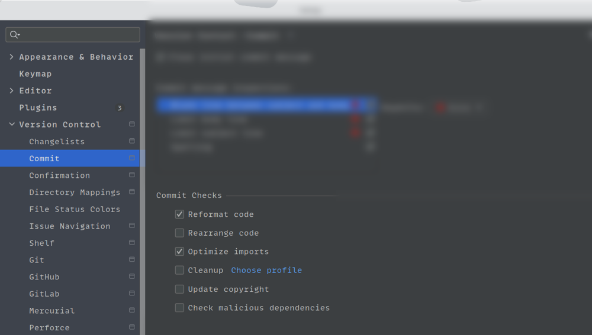

#### Längd på commit-meddelanden

Det är ett grundkrav att alla följer Conventional Commits. Det innebär dels
att begränsa längden på rader och att ha en tom rad mellan första raden och
resterande (de som kallas body).

I den övre delen av Settings / "Version Control" / Commit:

1. Aktivera "Clear initial commit message"
2. Aktivera "Blank line between subject and body" och välj:

   - Felnivå: "Error"
   - Right margin: 72
   - Aktivera "Show right margin"
   - Aktivera "Wrap when typing reaches right margin"

3. Aktivera "Limit subject line" och välj

   - Felnivå: "Error"
   - Right margin: 72

4. Aktivera "Spelling" med felnivå "Typo"

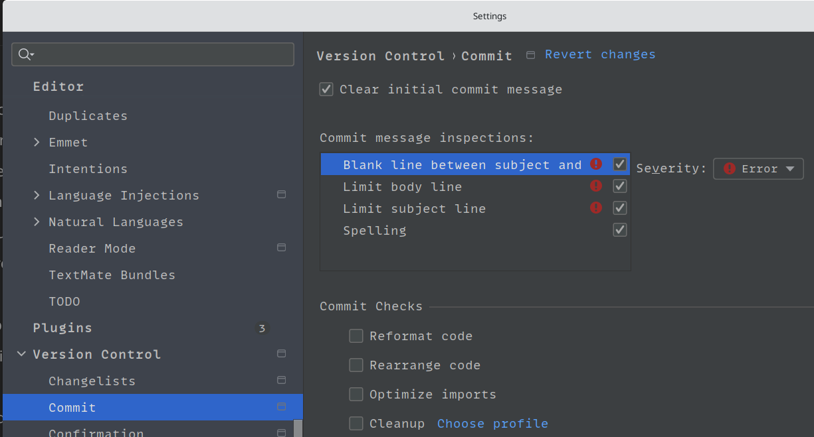

#### Conventional commits

Installera den fria pluginen [Conventional
Commit](https://plugins.jetbrains.com/plugin/13389-conventional-commit) genom
att söka efter dess namn i Settings / Plugins.

Efter omstart av utvecklingsmiljön finns Settings / "Conventional Commit"
men ni behöver inte ändra någon av dess inställningar.

##### Hjälp med meddelandet

Vid commit så får man nu hjälp att skriva ett korrekt commit-meddelande. I
Windows / Linux kan man trycka Ctrl + Space för att få upp förslag. Från en
tom meddelanderuta kan det se ut såhär:

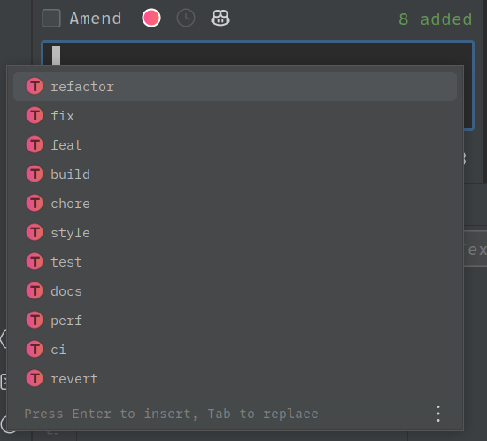

Not: För macOS är Ctrl + Space upptaget av operativsystemet. Googla på
problemet så finns det förslag på lösningar.

##### Hjälp med `Co-authored-by`

Som bekant är det mycket viktigt använda `Co-authored-by` för att
dokumentera att man arbetat tillsammans med någon. Det kan vanligtvis upplevas
lite bökigt med exakt stavning och att fylla i alla man samarbetat med.

Om man i meddelandets body skriver `co` så kommer två alternativ för
komplettering upp. Välj den översta som inte slutar med kolon:

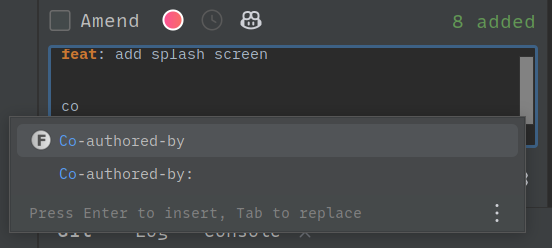

Välj sedan "Show more":

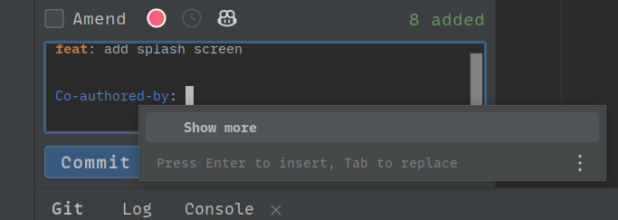

Lägg in de som behövs i listan. Aktivera sedan de som deltog och välj OK:

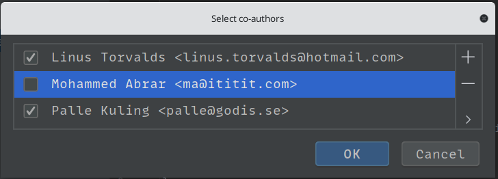

Då fylls de i fint i commit-meddelandet:

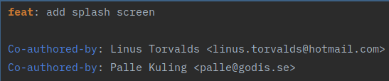

Försök att använda samma co-authorrad inom hela gruppen. Det blir bökigare
om man använder olika.

Men det som är vitalt är att använda en co-authorrad för varje person som
deltagit. Som nämnts och skrivits tidigare så är det enda sättet vi
använder för att få veta att en commit kommer från ett samarbete. Alla
commits utan sådan rad räknas som ensamarbete!

### Starkt rekommenderat

#### Formatera och importoptimera vid spara

Det är rekommenderat att göra "Reformat code" samt "Optimize imports" varje gång man sparar filen.

Dessa inställningar aktiveras i Settings / Tools / "Actions on Save":

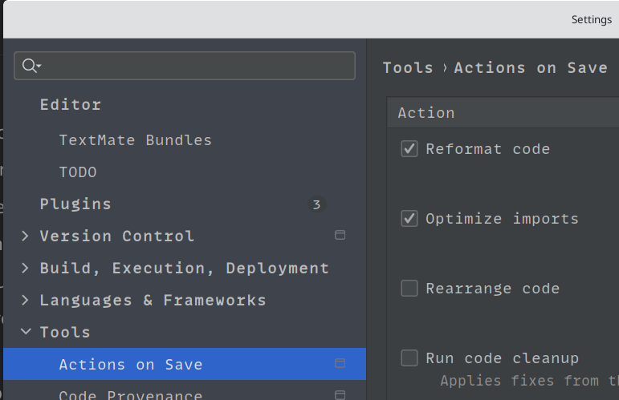

#### CSV Editor

Att ändra i CSV-filer som ren text blir jobbigare ju större fil det rör sig
om. Eftersom det är ett enkelt format för tabeller i textform finns det
fördelar med att hantera dem som tabeller.

För IntelliJ så gör pluginen [CSV
Editor](https://plugins.jetbrains.com/plugin/10037-csv-editor) det möjligt.
Installera denna fria plugin genom att söka efter dess namn i Settings /
Plugins.

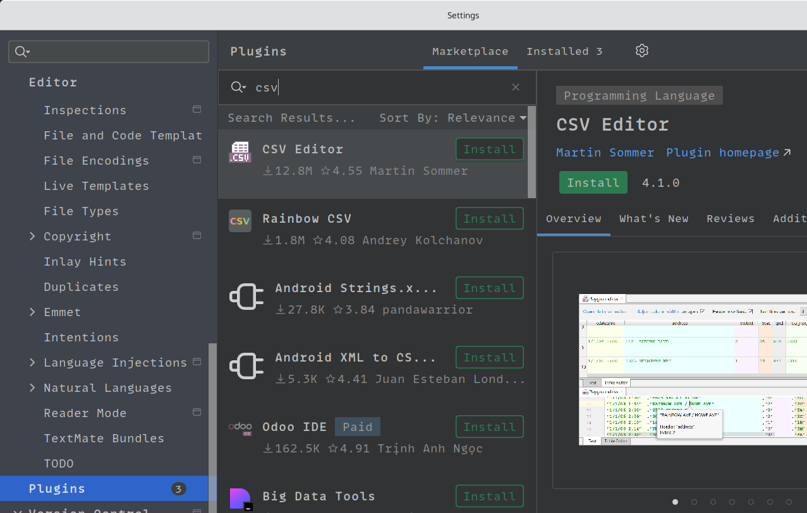

### Rekommenderat

#### JavaFx

Sätt "Path to SceneBuilder" i Settings / "Languages & Frameworks" / JavaFX för
att enkelt kunna starta SceneBuilder.

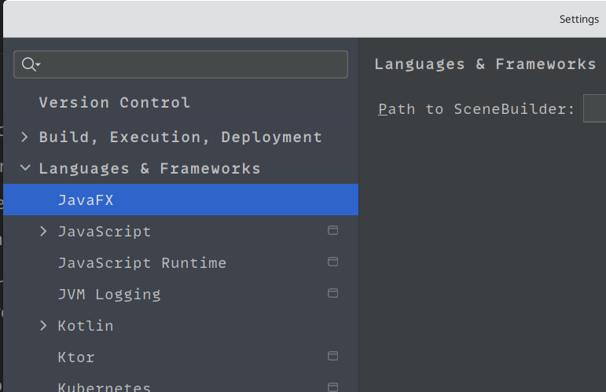

#### GitHub

Lägg till ditt konto med "Add account..." i Settings / "Version Control" /
GitHub för en bra integration mot GitHub. Den gör så att man kan se pull
requests och kommentera dessa utan att lämna utvecklingsmiljön.

#### Anpassa utseendet efter din smak

Det blir behagligare att använda ett program som ser ut som du vill. Gå
igenom Settings / "Appearance & Behavior" och testa olika inställningar för
färger, typsnitt och layout. Glöm inte att det även finns en massa Themes
som Plugins att ta hem.

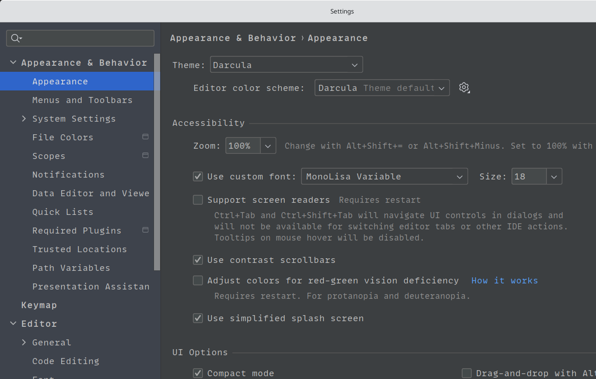

### Värt att fundera på

#### Vim?

Texteditorn Vim är högt prisat av många för dess effektiva metoder att
ändra i text. Själva idéerna bakom Vim är större än editorn i sig själv,
vilket gör att de flesta moderna utvecklingsmiljöer kan härma Vim. För
IntelliJ så finns pluginen
[IdeaVim](https://plugins.jetbrains.com/plugin/164-ideavim).

Installera denna fria plugin genom att söka efter dess namn i Settings /
Plugins.

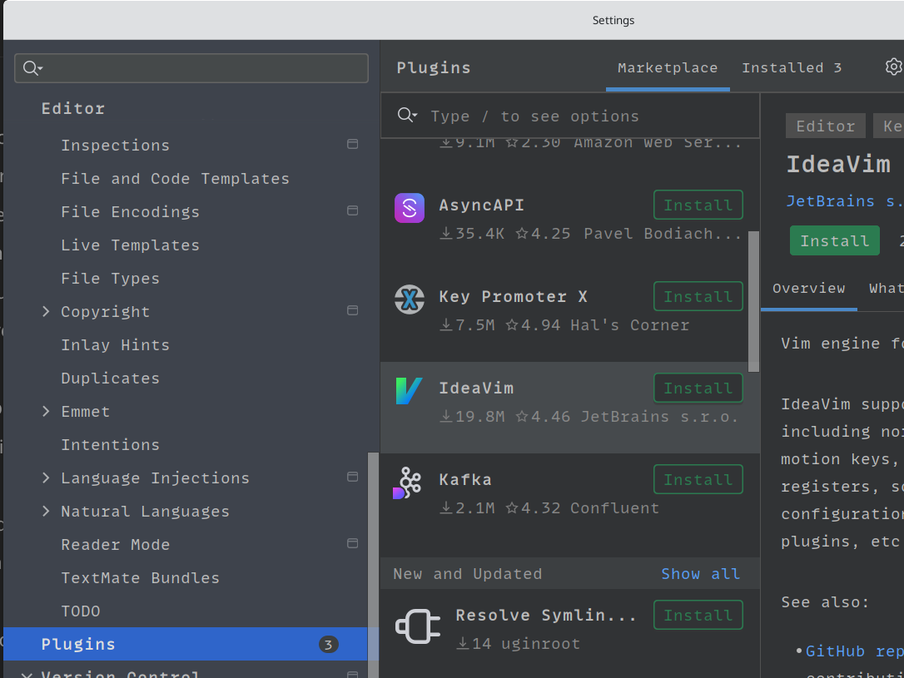

#### VSCode?

Den som är van med tangentbindningarna hos VSCode kan fortsätta använda dem
i IntelliJ genom pluginen [VSCode
Keymap](https://plugins.jetbrains.com/plugin/12062-vscode-keymap).

Installera denna fria plugin genom att söka efter dess namn i Settings /
Plugins.

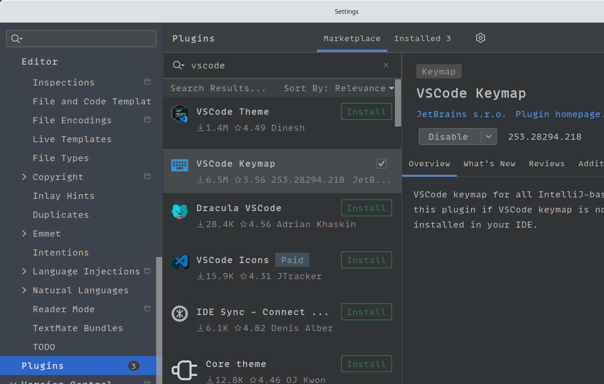

## Utforska

### Maximera värdet av IntelliJ

Testa alla funktioner och inställningar. Om man bara använder IntelliJ som en
ren texteditor så får man inte hela bilden av vad den kan. Några exempel är:

- Högerklicka på `src`-katalogen
- Testa olika saker i Analyze
- Välja alternativen i Diagrams
- Testa saker i Hamburgermenyn / Refactor (visar katalogalternativ)
- Högerklicka i en fil på olika saker som en metod, en variabel och testa
saker i Refactor (visar alternativ för delar av filer)
- Högerklicka på klassraden för varianterna utan arv, ärver, implementerar
ett interface och testa saker i Generate.

Utan att ha tittat djupare enligt ovan så riskerar man att missa skillnaden
jämfört med andra utvecklingsmiljöer. Kort sagt så är IntelliJ den absolut
kraftfullaste och mest populära utvecklingsmiljön för Java. Det är även
värt att notera att IntelliJ klarar av en massa olika språk.

Det kan hända att man t.ex. ändå föredrar VSCode av olika skäl. Den är
enkel, fri och det finns en massa extensions till den (vad IntelliJ kallar
plugins) som lägger till funktionalitet och anpassning. Min poäng är att det
är bra att utforska båda ordentligt.
