# Objektorienterad programmering

## Grunder

### Objekt, klass och instans

En **klass** är en mall (typ), en **instans** är en konkret sak skapad från mallen.

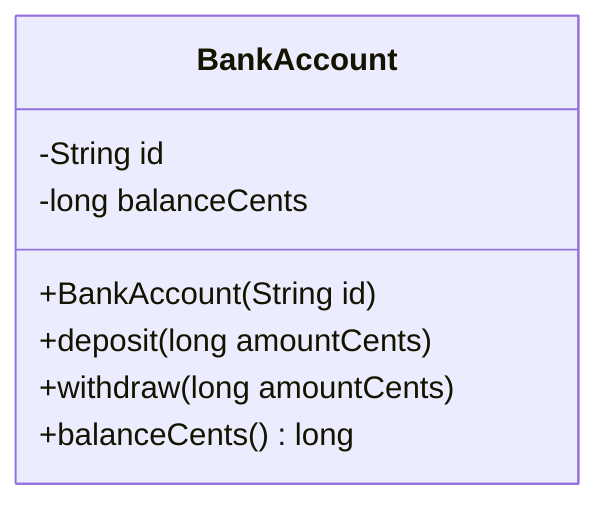

Ovanstående är ett första exempel på hur en klass kan ritas med [UML][uml].

Det man ser ovan är att klassen heter `BankAccount`. I den övre sektionen ser vi att klassen har instansvariablerna `id` och `balanceCents`. Dessa har typen `String` respektive `long`.

I den nedre delen ser vi att klassen har fyra *metoder*. En **metod** är ett annat ord för funktion som tillhör en klass. De tre första metoderna tar in ett argument var men returnerar inget. Den sista metoden returnerar antalet cent som en `long`.

Tecken innan instansvariablerna och metodernas namn visar med `-` om något är privat och inte kan nås utifrån. Det som går att nå och är publikt visas istället med ett `+`-tecken.

#### Typ vs objekt

I följande exempel finns det tre variabler (referenser) som pekar på två objekt i minnet. Objekt i Java är instanser av en klass, och klassen fungerar som en mall för hur objekten ser ut och beter sig.

Alla tre variabler har den deklarerade typen `BankAccount`. I just det här exemplet råkar även båda objekten ha runtime-typen `BankAccount`, men framöver kan en variabel av typen `BankAccount` även peka på en instans av en subklass.

```java
BankAccount pekkaSavings = new BankAccount("A-123");
BankAccount mainAccount = pekkaSavings;
BankAccount interestAccount = new BankAccount("B-777");
```

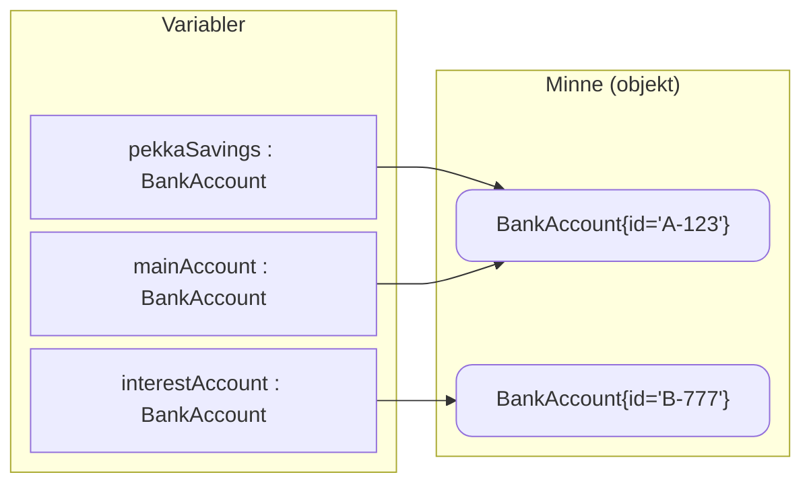

### Gränssnitt (interface)

Ett gränssnitt (interface) är ett kontrakt som beskriver vilka metoder som finns men inte hur de fungerar. Flera olika klasser kan uppfylla samma kontrakt så att resten av koden kan använda vad något kan göra i stället för vad det är.

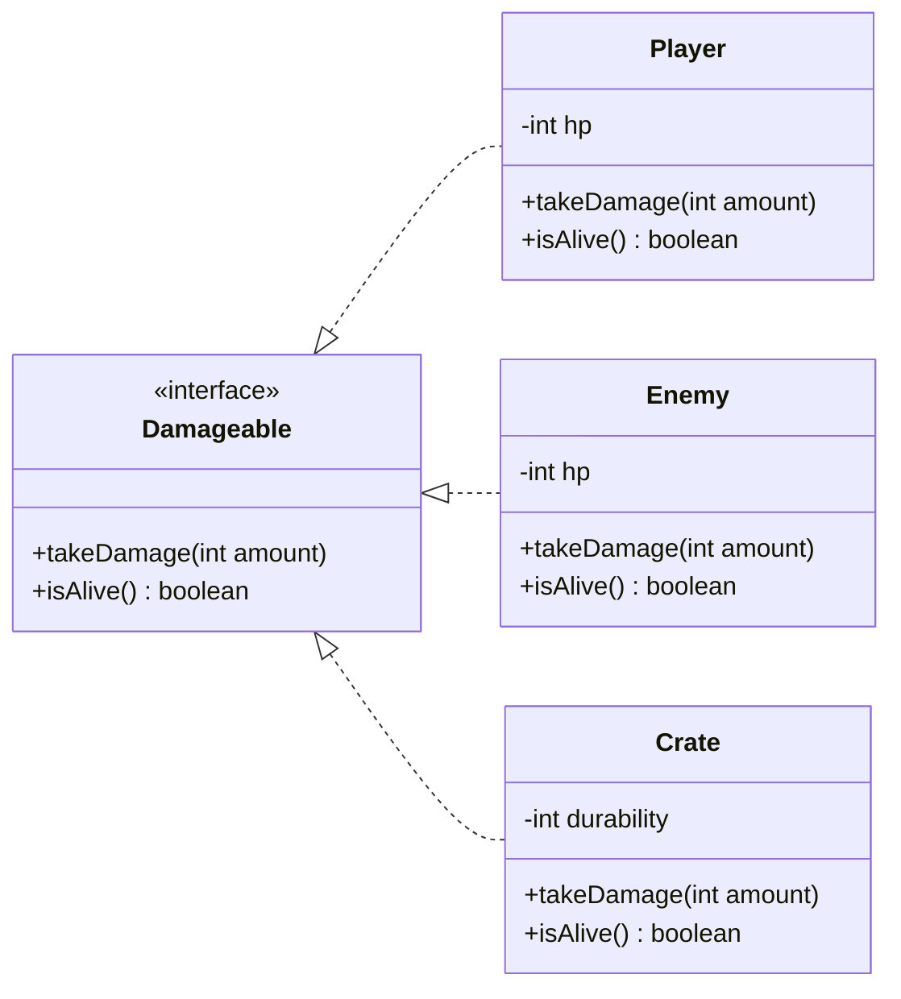

```java
/**
 * Kontrakt: något i spelet som kan ta skada.
 * Poängen: spelmotorn kan anropa takeDamage(...) utan att veta om det är Player, Enemy eller Crate.
 */
public interface Damageable {
    void takeDamage(int amount);
    boolean isAlive();
}

public final class Player implements Damageable {
    private int hp = 100;

    @Override
    public void takeDamage(int amount) {
        if (amount <= 0) throw new IllegalArgumentException("amount must be > 0");
        hp = Math.max(0, hp - amount);
    }

    @Override
    public boolean isAlive() {
        return hp > 0;
    }
}

public final class Enemy implements Damageable {
    private int hp = 40;

    @Override
    public void takeDamage(int amount) {
        if (amount <= 0) throw new IllegalArgumentException("amount must be > 0");
        hp = Math.max(0, hp - amount);
    }

    @Override
    public boolean isAlive() {
        return hp > 0;
    }
}

// En låda kan "gå sönder" men är inte en levande varelse.
// Ändå kan den följa kontraktet Damageable.
public final class Crate implements Damageable {
    private int durability = 10;

    @Override
    public void takeDamage(int amount) {
        if (amount <= 0) throw new IllegalArgumentException("amount must be > 0");
        durability = Math.max(0, durability - amount);
    }

    @Override
    public boolean isAlive() {
        return durability > 0; // "alive" = inte förstörd
    }
}
```

## Fyra grundpelare

Objektorienterad programmering har de fyra grundpelarna:

- **Inkapsling**: Ett objekts tillstånd (instansvariabler) skyddas från direkt åtkomst. Ändringar sker via metoder så objektet kan fortsätta fungera.
- **Abstraktion**: Exponera ett litet, stabilt API och dölj detaljer som kan ändras. Det gör koden enklare att använda och lättare att byta implementation.
- **Arv**: En “är-en”-relation där en subklass återanvänder/utökar en basklass. Används för att dela beteende, men bör användas sparsamt eftersom hierarkier kan bli starkt ihopkopplade så att ändringar i basklassen lätt sprids till subklasser.
- **Polymorfism**: Samma metodanrop kan ge olika beteende beroende på objektets verkliga typ (runtime). Ofta uppnås via interface eller arv, så att du kan programmera mot ett beteende/kontrakt i stället för konkreta klasser.

### Inkapsling

Objektet ska **själv kontrollera** hur tillstånd ändras: privata fält, ingen direkt åtkomst.

Det gör att objektet kan se till att dess **regler** följs och att dess **invariants** alltid håller:

- **Regler**: villkor som måste uppfyllas när du försöker göra en ändring.
  Exempel: “uttag måste vara ett positivt belopp” och “du får inte ta ut mer än saldot”.
- **Invariants**: saker som ska vara sanna hela tiden för att objektet ska vara i ett giltigt läge.
  Exempel: “saldo får aldrig vara negativt”.

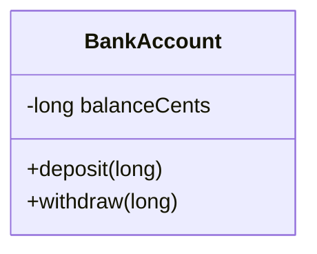

```java
public void withdraw(long amountCents) {
    if (amountCents <= 0) throw new IllegalArgumentException("amount must be > 0"); // regel
    if (balanceCents - amountCents < 0) throw new IllegalStateException("insufficient funds"); // regel
    balanceCents -= amountCents; // invariant hålls: balanceCents >= 0
}
// Ingen setBalance(...)
```

### Abstraktion

Exponera ett litet, stabilt API och göm detaljer som kan ändras. Resten av koden pratar med ett **kontrakt** (interfacet) och bryr sig inte om *Stripe vs Adyen vs Swish*.

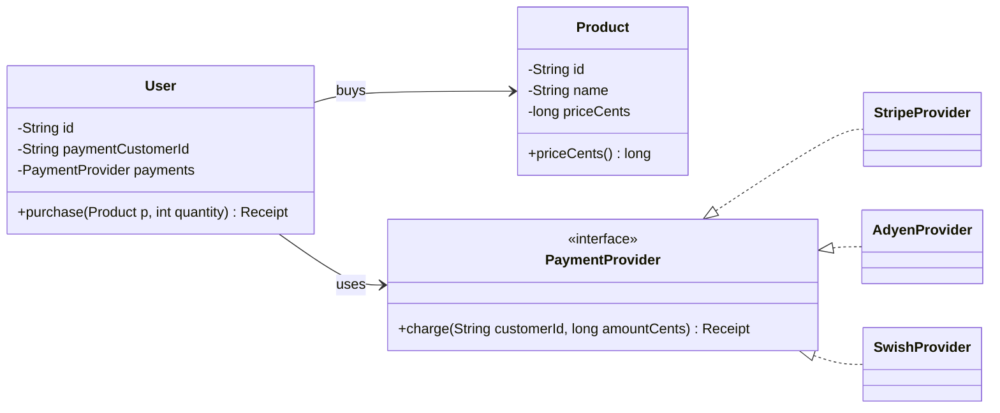

Låt oss säga att vi skriver kod för fysiska eller webbbutiker som säljer produkter. Vi har en klass för produkter:

```java
public final class Product {
    private final String id;
    private final String name;
    private final long priceCents;

    public Product(String id, String name, long priceCents) {
        this.id = java.util.Objects.requireNonNull(id);
        this.name = java.util.Objects.requireNonNull(name);
        if (priceCents < 0) throw new IllegalArgumentException("priceCents must be >= 0");
        this.priceCents = priceCents;
    }

    public long priceCents() { return priceCents; }
}
```

Det finns olika leverantörer av betallösningar med sina egna sätt att interagera med de som använder deras lösning. Det som de har gemensamt, vilket även *blir abstraktionen*, är att de alla kan initiera en debitering från en kunds konto. Låt oss definiera det gemensamma som interfacet `PaymentProvider`:

```java
// En record är som en klass men får inte ändras efter skapandet (mer formellt på engelska kallad "immutable").
public record Receipt(String paymentId, long amountCents) { }

public interface PaymentProvider {
    Receipt charge(String customerId, long amountCents);
}

public final class StripeProvider implements PaymentProvider { /* ... */ }
public final class AdyenProvider  implements PaymentProvider { /* ... */ }
public final class SwishProvider  implements PaymentProvider { /* ... */ }
```

Nu kan vår programkod kopplas mot beteendet som vår abstraktion fångar i interfacet `PaymentProvider`, istället för att innehålla detaljerna kring de olika anrop som behövs för t.ex. Stripe eller Swish:

```java
public final class User {
    private final String id;
    private final String paymentCustomerId;
    private final PaymentProvider payments;

    public User(String id, String paymentCustomerId, PaymentProvider payments) {
        this.id = java.util.Objects.requireNonNull(id);
        this.paymentCustomerId = java.util.Objects.requireNonNull(paymentCustomerId);
        this.payments = java.util.Objects.requireNonNull(payments);
    }

    public Receipt purchase(Product product, int quantity) {
        java.util.Objects.requireNonNull(product);
        if (quantity <= 0) throw new IllegalArgumentException("quantity must be > 0");

        long amountCents = Math.multiplyExact(product.priceCents(), quantity);

        // "withdraw" i betydelsen: dra pengar via vald provider,
        // utan att User behöver veta om det är Stripe/Adyen/Swish.
        return payments.charge(paymentCustomerId, amountCents);
    }
}
```

### Polymorfism via interface (dynamisk dispatch)

Samma metodanrop, olika beteende beroende på **verklig typ vid runtime**.

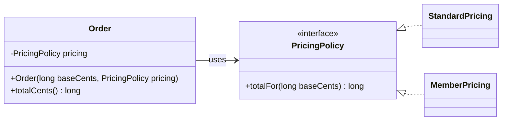

Koden jobbar mot interfacet `PricingPolicy` (kontraktet), inte mot en specifik klass. När `Order.totalCents()` anropar `pricing.totalFor(...)` väljer Java vid runtime rätt implementation baserat på objektets verkliga typ (`StandardPricing` eller `MemberPricing`). Det gör att vi kan lägga till nya prisregler utan att ändra `Order`—vi byter bara vilken policy som injiceras.

```java
Order regular = new Order(12_500L, new StandardPricing()); // 125,00
Order member  = new Order(12_500L, new MemberPricing());   // medlem får annan beräkning
```

### Arv (inheritance)

Arv betyder att en subklass ärver fält och metoder från en basklass och kan återanvända och utöka beteendet. Det passar när relationen verkligen är en tydlig “är-en” och när basklassen är stabil.

**Fördelar:**

- Kan återanvända gemensam kod och gemensamma regler på ett ställe
- Gör det möjligt att behandla subklasser som basklassen i API:er
- Kan förenkla när du har en liten, stabil hierarki med tydliga varianter

**Nackdelar:**

- Skapar stark koppling till basklassens design och förändringar sprider sig lätt
- Risk för “fel” modellering där subklassen inte riktigt är en basklass
- Hierarkier blir svåra att ändra när behoven växer åt nya håll
- Kan ge oväntade sidoeffekter när subklasser måste passa in i basklassens beteende

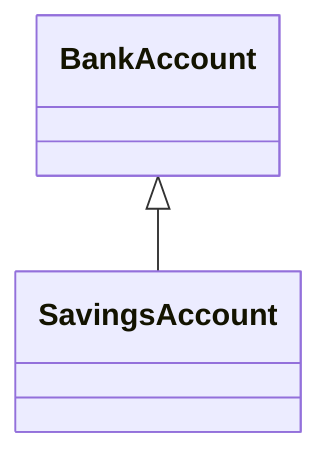

```java
public class SavingsAccount extends BankAccount {
    // Fråga: är det verkligen "är-en", eller är det bara "har extra regler"?
    // Om det mest handlar om extra regler kan komposition ofta bli enklare.
}
```

### Objekts uppbyggnad

#### Komposition

Bygg objekt av andra objekt i stället för att ärva.

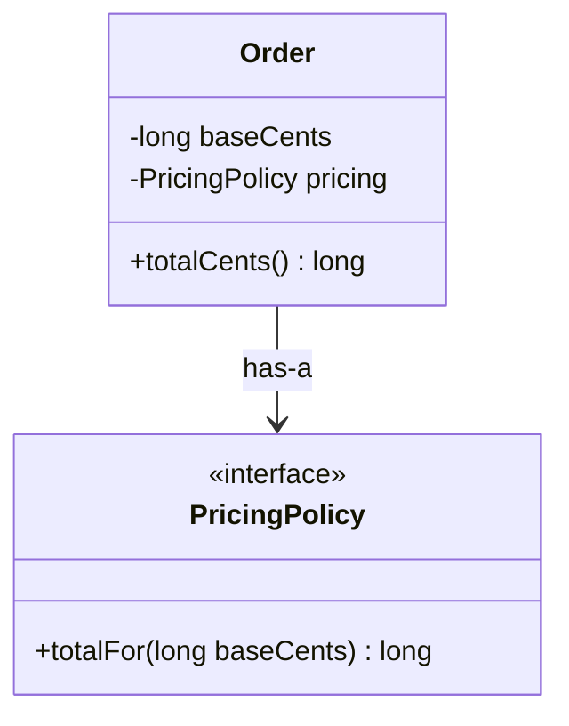

```java
public final class Order {
    private final long baseCents;
    private final PricingPolicy pricing;

    public Order(long baseCents, PricingPolicy pricing) {
        this.baseCents = baseCents;
        this.pricing = java.util.Objects.requireNonNull(pricing);
    }

    public long totalCents() {
        return pricing.totalFor(baseCents); // delegation: Order skickar vidare jobbet
    }
}
```

#### Delegation

Objektet vidarebefordrar arbete till ett annat objekt som äger logiken.

```java
public interface PricingPolicy {
    long totalFor(long baseCents);
}

public final class StandardPricing implements PricingPolicy {
    @Override
    public long totalFor(long baseCents) {
        return baseCents;
    }
}

public final class MemberPricing implements PricingPolicy {
    @Override
    public long totalFor(long baseCents) {
        return Math.max(0, baseCents - 500); // t.ex. 5 kr rabatt
    }
}
```

### Objekts tillståndsförändringar

#### Kontrakt och invariants

##### Invariant

Något som alltid måste vara sant för ett giltigt objekt.

```java
// invariant: balanceCents >= 0
```

##### Preconditions

Krav på input, faila tidigt.

```java
public void deposit(long amountCents) {
    if (amountCents <= 0) throw new IllegalArgumentException("amount must be > 0");
    // ...
}
```

##### Postconditions

Vad metoden garanterar efter körning.

```java
/**
 * Deposits money.
 * @throws IllegalArgumentException when amountCents <= 0
 * Post: newBalance = oldBalance + amountCents
 */
public void deposit(long amountCents) { /* ... */ }
```

##### Fail early

Stoppa fel nära källan.

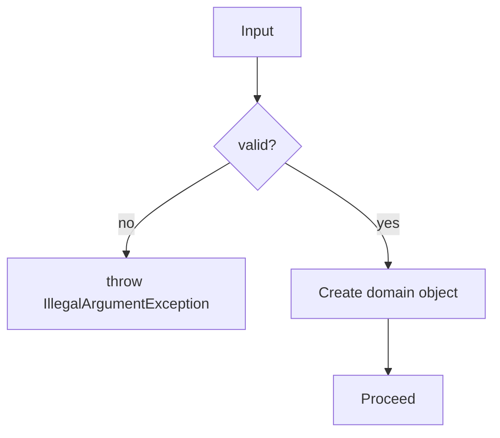

#### Tvåstegs-init (init/lazy init)

Undvik halvfärdiga objekt.

```java
// sämre:
DbClient c = new DbClient();
c.init();

// bättre (fabrik / connect):
DbClient c = DbClient.connect(url, user, pass);
```

#### Design by contract som tanke

Kontrakt = invariant + pre/post + dokumenterade exceptions.

```java
/**
 * @throws CustomerNotFound when no customer exists for id
 * @throws IllegalArgumentException when id is null
 */
public Customer loadCustomer(CustomerId id) { /* ... */ }
```

## God design

### Tydligt ansvar

Ett objekt ska ha ett tydligt jobb.

```java
// sämre: blandar prissättning + email
public final class Invoice {
    public long totalCents() { /* ... */ return 0; }
    public void sendEmail() { /* ... */ }
}

// bättre: separera "beräkna" och "skicka"
public final class Invoice { public long totalCents() { return 0; } }
public final class InvoiceMailer { public void send(Invoice inv) { } }
```

### Cohesion vs coupling

Flytta regler dit de hör hemma så de inte dupliceras i “yttre lager”.

```java
// controller-spridd regel (lägre cohesion):
if (order.getStatus() == Status.PAID) throw ...

// domänmetod (högre cohesion):
order.cancel();
```

### Tell, don’t ask

Be objektet göra jobbet.

```java
// sämre:
if (order.getStatus() == Status.NEW) { order.setStatus(Status.CANCELLED); }

// bättre:
order.cancel();
```

### Anemisk domänmodell

Data + setters → logik hamnar i services (procedur).

```java
// anemisk:
class OrderDTO { public String status; public List<ItemDTO> items; }

// rik domän:
final class Order {
    private Status status;
    public void addItem(Item item) { /* invariant checks */ }
    public void pay(Payment p) { /* rules */ }
}
```

### Polymorfism vs switch/if-kedjor

Om du ofta branch:ar på typ/status: strategi/state kan göra koden renare.

```java
public interface ShippingCostPolicy {
    long costCentsFor(Order order);
}

public final class SwedenShipping implements ShippingCostPolicy { /* ... */ }
public final class GermanyShipping implements ShippingCostPolicy { /* ... */ }
```

### KISS + YAGNI

Börja konkret. Abstrahera när du faktiskt har en variation som kostar att duplicera.

```java
// börja:
final class FileStorage { /* ... */ }

// senare (när 2 varianter finns):
interface Storage { /* ... */ } // t.ex. File + S3
```

### Law of Demeter

Undvik getter-kedjor som kopplar till intern struktur.

```java
// sämre:
String country = order.getCustomer().getAddress().getCountry();

// bättre:
boolean isEu = order.isEuropean();
```

### Fluent API vs objektgraf-navigering

Kedjor är ofta ok i builders (stannar i samma API för ett objekt).

```java
Request req = Request.builder()
        .timeoutMillis(500)
        .header("X-Id", "123")
        .build();
```

Men var försiktig i domänen (en massa objekt behöver ofta returnera varandra):

```java
a.getB().getC().doX(); // kan vara ett symtom av dålig design
```

### “Fail fast” vs “recover”

- Fail fast: kontraktsbrott (NPE, invalid input)
- Recover: tidsbegränsning, nätverk (retry/fallback kan vara rimligt)

### Mönstret "Dependency Injection"

Mata in beroenden utifrån för utbytbarhet/testbarhet.

```java
public final class OrderService {
    private final Clock clock;
    private final PaymentProvider payments;

    public OrderService(Clock clock, PaymentProvider payments) {
        this.clock = java.util.Objects.requireNonNull(clock);
        this.payments = java.util.Objects.requireNonNull(payments);
    }
}
```

## Vanlig design

### Lagerarkitektur (HTTP-app)

#### Varför lager finns

Separera concerns (HTTP, applikation, data) och håll beroenderiktning tydlig.

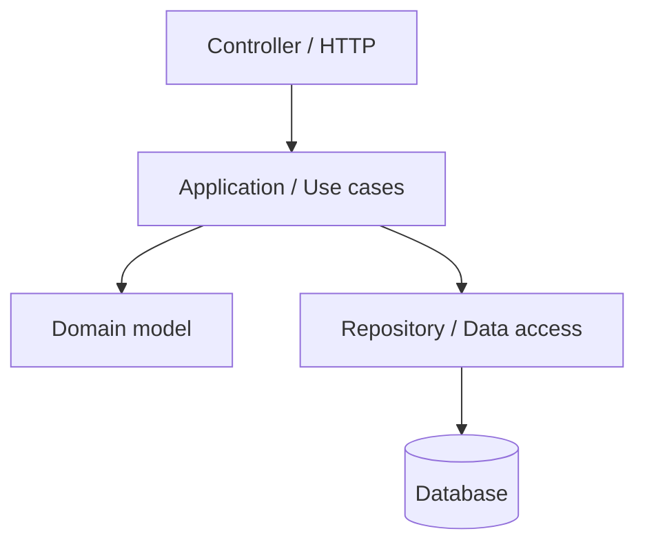

Anropsexempel:

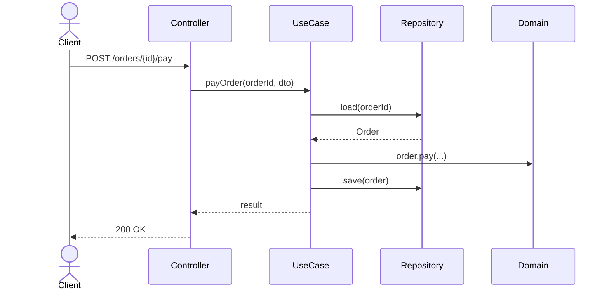

### Pass-through-lager som antipattern

Om ett lager bara vidarebefordrar utan beslut: ofta onödig indirektion.

```java
// symptom: Service som bara kallar repo
class OrderService {
    private final OrderRepo repo;
    OrderService(OrderRepo repo) { this.repo = repo; }

    OrderDTO get(String id) { return repo.get(id); } // pass-through
}
```

### DTO-CRUD överallt (spridda invariants)

När många endpoints gör `load dto → set fields → save` sprids reglerna.

```java
// risk: invariants bor "överallt"
dto.status = "PAID";
dto.totalCents = dto.totalCents - dto.discountCents;
repo.save(dto);
```

### Aggregate-tänk (utan att bli DDD-tung)

Samla ändringar bakom domänmetoder.

```java
public final class Order {
    private Status status;
    private long totalCents;

    public void addItem(Item item) { /* checks */ }
    public void pay(Payment p) {
        if (status == Status.PAID) throw new IllegalStateException("already paid");
        status = Status.PAID;
    }
}
```

[uml]: https://en.wikipedia.org/wiki/Unified_Modeling_Language
